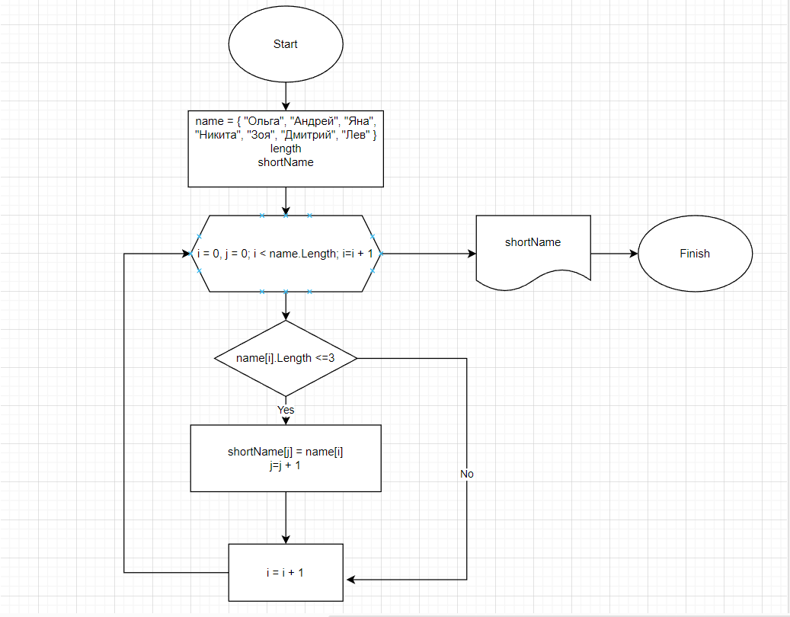

В данном проекте поставлена задача на нахождение в одномерном массиве элемента содержащего в себе не более 3 символов.

Массив введён по умолчанию.

По данной блок схеме пишем код для решения задачи.

1. Первым делом инициализируем и обозначаем массив.
2. Для заполнения нужными данными нового массива мы должны узнать сколько памяти нам необходимо выделить на заполняемый массив,т.ч. пишем метод который посчитает сколько элементов массива имеют длину не более 3 символов.
3. Узнав эту тайну инициализируем новый массив:
string[] shortName = new string[length];
4. Теперь его нужно заполнить элементами у которых длина не превысит 3 символа.Используем цикл FOR.
5. После, необходимо отобразить вывод.